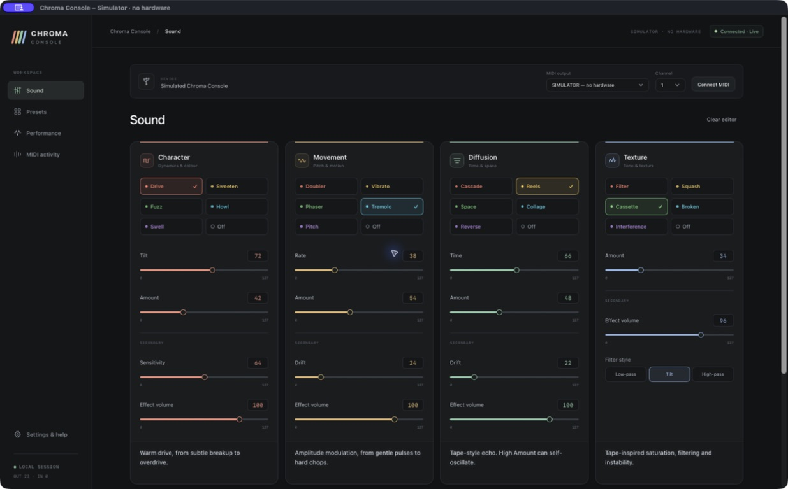
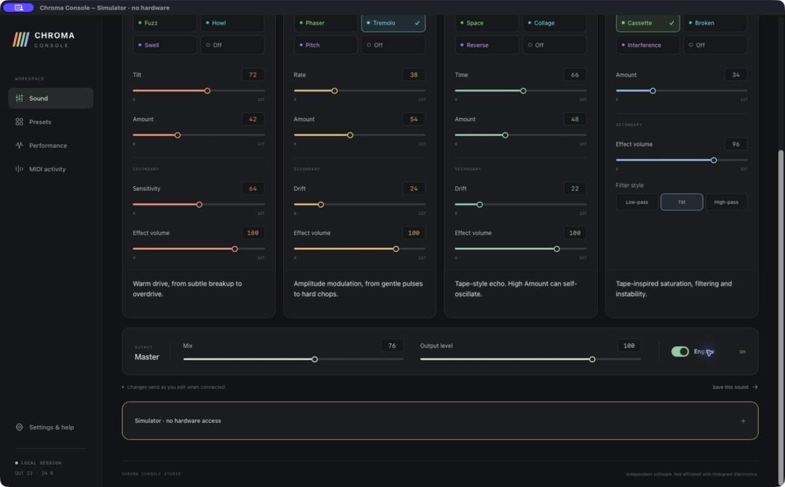
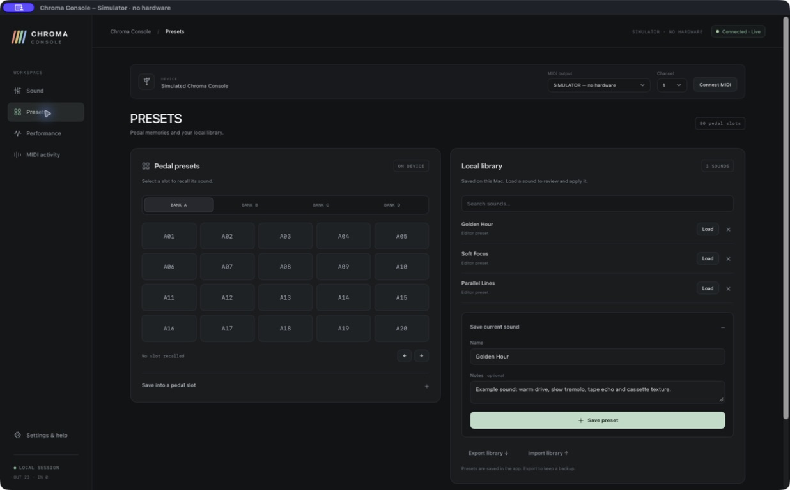
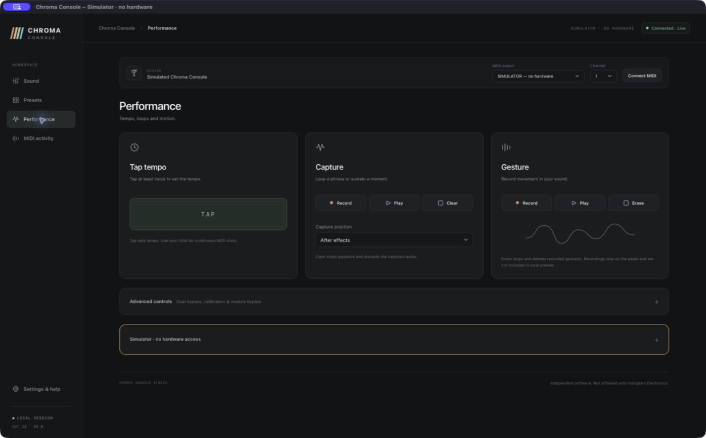
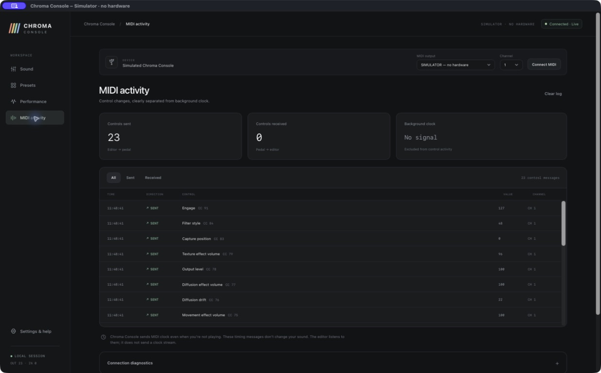

# Chroma Console Studio

A standalone macOS MIDI editor for the **Hologram Electronics Chroma Console**. Control the pedal over USB from a desktop app, with a local preset library and a dark interface.

Independent community software. Not affiliated with or endorsed by Hologram Electronics.

## Download and install

Get the `.dmg` from [Releases](https://github.com/georgekorpas/chroma-console-studio/releases). Open it, drag **Chroma Console.app** into **Applications**, then eject the disk image.

**Requirements:** Apple Silicon Mac (M1 or later), macOS 13 or later, a powered Chroma Console and a USB data cable. This release does not support Intel Macs. Runtime testing has been on macOS 26.1; earlier supported versions have not yet been independently tested. No browser, Python installation or developer tools are needed to run the app.

**This beta is ad-hoc signed and is not Apple-notarized.** macOS may block its first launch. If you trust this project's download, first try opening the installed app, then use **System Settings → Privacy & Security → Open Anyway** if macOS offers that option. Confirm the app-specific prompt. See [Apple's instructions](https://support.apple.com/en-us/102445). An organization-managed Mac may restrict this option. The installer does not change macOS security settings.

`SHA256SUMS.txt` is included with each release to check download integrity. In the download folder, run `shasum -a 256 -c SHA256SUMS.txt` after downloading both release assets named in that file.

## Connect and play

1. Power Chroma Console normally and connect it to your Mac by USB.
2. Launch the app. A single connected Chroma Console is selected automatically.
3. Match the MIDI channel to the pedal; channel 1 is the default.
4. Choose an effect, move a parameter or use the Engage toggle. Changes send immediately while connected.

USB carries MIDI control, not audio. Listen through the pedal's audio connections. Engage/Bypass controls the effects; it does not switch the pedal's electrical power.

## App walkthrough

These are screenshots of the **Mac app in its isolated simulator**, using example sounds created for this guide. In normal use, the connection bar shows your physical Chroma Console. Click any screenshot to view it at full size.

[Sound](#1-shape-a-sound) · [Output and Engage](#2-set-the-output-and-engage-the-pedal) · [Presets](#3-recall-and-save-presets) · [Performance](#4-use-the-performance-controls) · [MIDI activity](#5-understand-midi-activity)

### 1. Shape a sound



The four cards mirror the pedal's **Character, Movement, Diffusion and Texture** modules. Every effect is visible: click its name once to select it. The highlight and dot use the corresponding effect colour on the pedal. Choose **Off** to turn a module off.

| Where to look | What to do |
| --- | --- |
| Connection bar at the top | Select the Chroma Console MIDI output and match its MIDI channel. The connected Mac app enables live control automatically. |
| Effect buttons | Choose one of five effects in each module; the short description below the controls explains the selected effect. |
| Sliders and number boxes | Drag a slider or enter a value from **0–127**. Each edit sends immediately while connected. |
| Secondary controls | Adjust Sensitivity, Drift and each module's Effect volume where available. Texture also exposes Filter style. |

The screenshot uses **Drive, Tremolo, Reels and Cassette**. The app does not set module order; configure the signal-chain order on the pedal.

### 2. Set the output and engage the pedal



Scroll below the modules to reach **Master**. **Mix** sets the dry/effected balance, **Output level** sets the output level, and **Engage** switches the effects between engaged and bypassed. It does not control the pedal's electrical power.

Live edits need no extra Send step. **Apply unsent edits** appears when settings are waiting to be sent, such as edits prepared offline or a restored editing session. Starting or reconnecting the app does not replay those settings automatically. **Clear editor** clears the editor's current values without changing the pedal's sound.

### 3. Recall and save presets



**Pedal presets, on the left:** choose bank **A, B, C or D**, then click a numbered slot to recall one of the pedal's **80 internal presets**. The arrow buttons recall the previous or next slot. Recall clears the displayed parameter values because the pedal does not report the contents of the selected preset.

**Local library, on the right:** keep named settings on your Mac.

1. Shape a sound on the Sound page, then use **Save this sound** or **⌘S**.
2. Enter a name and optional notes, then click **Save preset**.
3. Later, click **Load** beside a saved sound to prepare it in the editor. Review it, then click **Apply loaded preset** on the Sound page to send its settings.
4. Use **Export library** for a JSON backup, and **Import library** to bring saved sounds into the app.

Local presets contain the parameter values known to the editor, optionally based on a recalled pedal slot. They are not full pedal backups and do not write into the pedal's internal slots. Use the pedal itself to save an internal preset. The example names shown here are for the walkthrough and are not bundled factory sounds.

### 4. Use the performance controls



| Tool | How to use it |
| --- | --- |
| **Tap tempo** | Tap at least twice to set tempo. The app sends tap commands; use a DAW if you want a continuous MIDI clock source. |
| **Capture** | Use **Record** and **Play** for the pedal's captured phrase. **Capture position** selects Before effects or After effects. **Clear** stops playback and discards the captured audio. |
| **Gesture** | Use **Record** to record parameter movement and **Play** to play it back. **Erase** stops and deletes the recorded gestures. |
| **Advanced controls** | Expand this section for dual bypass, input calibration and optional dedicated module bypass controls. |

Capture audio and Gesture recordings stay on the pedal and are not stored in the app's local preset library.

### 5. Understand MIDI activity



The counters separate **Controls sent**, **Controls received** and **Background clock**. In the example above, the simulator has sent 23 control messages. Each log row shows a direction, control name, MIDI message, value and channel. **CC** means Control Change; **PC** means Program Change, used here to recall a pedal preset. Filter the log with **All**, **Sent** or **Received**.

The pedal can send MIDI clock while you are not playing. These timing messages are counted separately and do not appear as sound edits in the control log. Expand **Connection diagnostics** to inspect the input port and clock-message count. **Clear log** only clears the displayed history.

A sent message shows that the app dispatched a command; it is not a readback of the pedal's current sound. If you see Sent activity but hear no response, check the MIDI channel, Engage state and whether the pedal is outside its settings or preset menus. Physical knob changes did not send parameter feedback in our testing; see the limitations below.

## What the pedal can and cannot report

The app follows supported incoming CC and Program Change messages. In hands-on testing, physical knob changes did **not** produce parameter feedback from the pedal. Full two-way knob synchronization and reading the pedal's current sound are therefore unavailable in the tested setup.

Local presets store known parameter overrides, optionally based on a pedal slot. They are **not full pedal backups**. The published MIDI interface does not provide remote internal-slot saving, preset dumps/readback, module reordering, expression assignment or dual-bypass group assignment. Configure these on the pedal. Captured audio, Gesture recordings, tapped tempo, calibration and bypass state are excluded from local presets.

Dedicated module bypass is an opt-in compatibility feature for existing pedal firmware that supports it. The editor does not query or update firmware. The effect list's **Off** choice is available independently.

## Device access

The app sends only allowlisted documented MIDI CC messages and Program Changes 0–79. Both JavaScript and native Swift validate the outgoing commands. There is no raw MIDI output operation, SysEx, WebUSB, updater, firmware query, bootloader operation or reset command.

The app uses native CoreMIDI and bundled WebKit assets. It has no accounts, analytics, cloud storage or continuous outgoing MIDI clock. Hologram's default MIDI routing can forward USB commands to downstream DIN MIDI devices on the same channel.

## Data and shortcuts

Presets and session data are stored in `~/Library/Application Support/Chroma Console Studio/`. Use **File → Show Preset Files** to find them, and export your library to keep a backup. Replacing the app during an update leaves this data separate from the app bundle.

- `⌘S`: open the preset-save form.
- `⌘O` / `⌘E`: import / export a preset library.
- `⌘1`–`⌘5`: navigate the workspace.
- `⌘R`: refresh MIDI ports.
- `⌘,`: settings and help.

## Build, test and package

Building requires macOS, Python 3, and an installed Apple SDK/Swift toolchain. The reference build uses Xcode 26.3. There are no third-party runtime dependencies.

```sh
python3 macOS/test.py
python3 macOS/package.py
```

The package command builds the app, verifies its local signature, creates a compressed DMG, verifies the image, and writes a clean source ZIP and SHA-256 checksums into `dist/`. It does not contact Apple or access the pedal.

**Help → Protocol Diagnostics** runs the protocol suite without hardware access. Its **Run interface checks (simulated)** link tests rapid slider edits and Apply behavior in an isolated view. See [the developer guide](macOS/README.md) and [release instructions](RELEASING.md).

The browser edition remains available for development: run `python3 server.py` and visit `http://127.0.0.1:8765` in a browser with Web MIDI support. Add `?demo=1` for the simulator, or `?demo=1&test=ui` for interface checks.

## Feedback

This is an initial public beta. When reporting a problem, include the app version, macOS version, Mac model and steps to reproduce it. Describe whether the issue happens with the simulator or the physical pedal. Avoid including personal preset libraries unless you intend to share them.

Protocol reference: [official Chroma Console manual](https://www.hologramelectronics.com/pages/chroma-console-manual).
